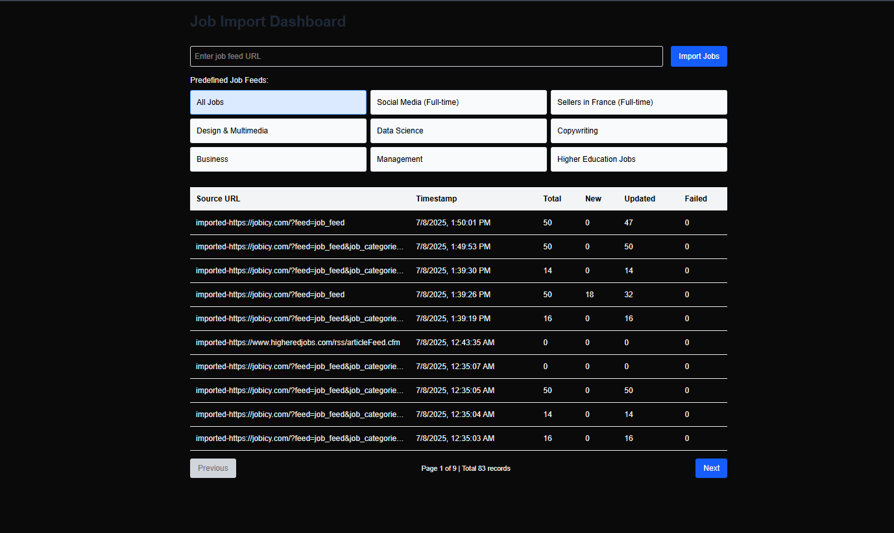

# Full Documentation

A complete MERN Stack-based project for importing, processing, and tracking job feeds using Redis Queue and MongoDB, with a clean admin interface.

---

## Table of Contents

1. Project Overview
2. System Architecture & Design
3. Technology Stack
4. Folder Structure
5. Backend Setup
6. Frontend Setup
7. API Flow & Endpoints
8. Job Queue with Redis
9. User Interface Overview
10. Error Handling & Troubleshooting
11. Future Enhancements

---

## 1. Project Overview

The **Job Importer** is a scalable job ingestion system that:
- Fetches job listings from external XML APIs
- Parses and queues them using Redis
- Processes them asynchronously using Bull queue
- Stores job data in MongoDB
- Displays import logs in a clean UI built with Next.js

---

## 2. System Architecture & Design

```plaintext
[User]
   ↓
[Frontend (Next.js)]
   ↓
[Backend (Express.js)]
   ↓
[Controller → Service Layer → Queue → Worker → MongoDB → Import Logs]
```

- XML Job Feed → Parse (XML → JSON)
- Queue jobs into Redis (Bull)
- Worker processes the job → Inserts/Updates MongoDB
- Logs each import run
- Admin UI shows import history

---

## 3. Technology Stack

| Layer       | Technology         |
|------------|--------------------|
| Frontend   | Next.js, Tailwind CSS |
| Backend    | Express.js, Node.js |
| Job Queue  | Bull (Redis)        |
| Database   | MongoDB (Mongoose)  |
| Scheduler  | node-cron / node-schedule |
| API Parser | fast-xml-parser     |

---

## 4. Folder Structure

```bash
job-importer/
├── backend/
│   ├── config/         # MongoDB & Redis config
│   ├── controllers/    # jobController.js
│   ├── models/         # Job.Model.js, ImportLog.Model.js
│   ├── queues/         # jobQueue.js (Bull setup)
│   ├── services/       # jobServices.js (business logic)
│   ├── routes/         # jobRouter.js
│   ├── utils/          # Helpers
│   ├── app.js / server.js
│   └── .env
├── frontend/
│   ├── app/
│   │   ├── components/       # ImportHistoryTable.js, JobFeedsForm.js
│   │   ├── lib/              # api.js (Axios setup)
│   │   ├── page.js, layout.js
│   └── .env.local
```

---

## 5. Backend Setup

### Prerequisites:
- Node.js v16+
- MongoDB (local/Atlas)
- Redis (via Docker or Redis Cloud)

### a. Environment Variables

Create a `.env` file in the `backend/` directory:

```env
PORT=4000
MONGODB_URI = "mongodb://localhost:27017/Job-Impoter"
REDIS_URL=redis://localhost:6379
REDIS_PORT=6379
```

### b. Install Dependencies

```bash
cd backend
npm install
```

### c. Run Redis (Docker)

```bash
docker run --name redis -p 6379:6379 -d redis
```

### d. Start Backend Server

```bash
npm run dev
```

---

## 6. Frontend Setup

### a. Environment File

Create a `.env.local` file in the `frontend/` directory:

```env
NEXT_PUBLIC_API_URL='http://localhost:4000/api/v1/jobs'
```

### b. Install Dependencies

```bash
cd frontend
npm install
```

### c. Start Next.js Frontend

```bash
npm run dev
```

Visit: [http://localhost:3000](http://localhost:3000)

---

## 7. API Flow & Endpoints

### a. Import Jobs

```http
POST /api/v1/jobs/import
Body: { "url": "https://jobicy.com/?feed=job_feed" }
```

**Flow:**
- Controller receives URL
- Service fetches and parses XML
- Jobs pushed to Redis queue
- Worker processes and saves to MongoDB
- Import log saved

### b. Get Import History

```http
GET /api/v1/jobs/history
```

**Response:** List of import logs with counts and status
### b. Get All JOBS

```http
GET /api/v1/jobs/getjobs
```
**Response:** List of all jobs which listed
---

## 8. Job Queue & Redis

### a. Why Redis?

- Fast in-memory storage
- Bull uses Redis for job management (pending, retry, failure, completed)

### b. Worker Processing

- `jobQueue.process()` receives jobs
- Each job validates and saves to DB
- Failures are logged in ImportLog

---

## 9. User Interface Overview

### a. `JobFeedsForm.js`

- URL input field
- Predefined API buttons
- Submit button to start import

### b. `ImportHistoryTable.js`

- Displays:
  - Source URL
  - Timestamp
  - Total / New / Updated / Failed Jobs
- Pagination supported

### c. API Layer – `lib/api.js`

- Uses Axios to connect frontend to backend:
  - `POST /import`
  - `GET /history`

---

## 10. Error Handling & Troubleshooting

- **Frontend:**
  - Shows error messages and loading indicators
- **Backend:**
  - Handles XML fetch/parse errors
  - Logs DB and queue errors
- **Common Issues:**
  - Incorrect API URL
  - Redis/MongoDB not running
  - Wrong `.env` config

---

## 11. Future Enhancements

- Add all cloud i.e; Redis cloud & MongoDB Atlas
- Real-time import status with WebSockets or SSE
- UI enhancements 
- Deploy to Vercel 

---



